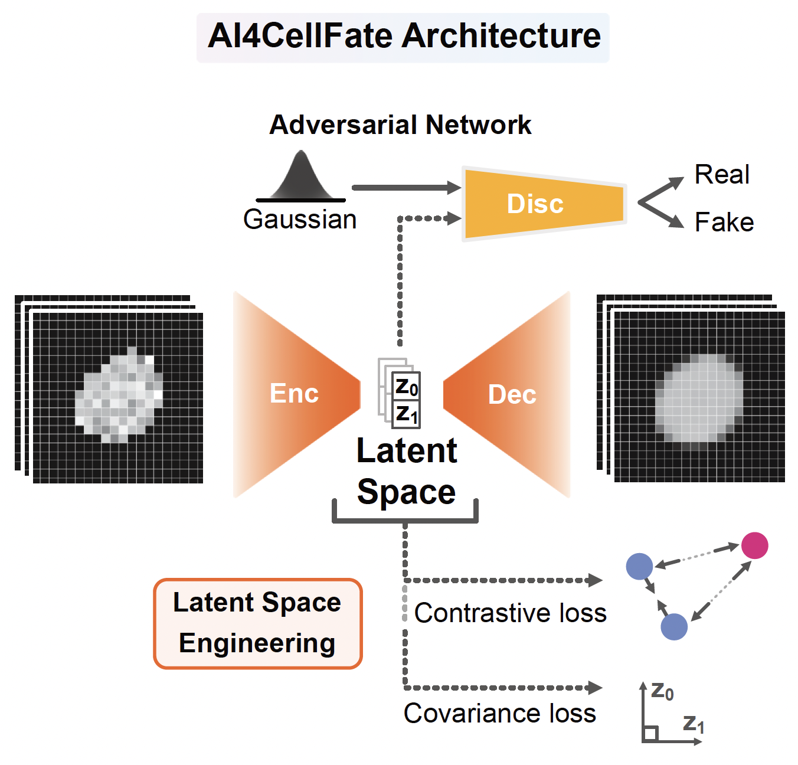

# AI4CellFate: Interpretable Early Cell Fate Prediction with Generative AI

[](https://colab.research.google.com/github/ComputationalMicroscopy4CellBio/AI4CellFate/blob/main/notebooks/Codeless_AI4CellFate_Google_Colab.ipynb)

AI4CellFate is a deep learning framework for **interpretable cell fate prediction** from single-frame microscopy images. The project implements an adversarial autoencoder architecture that combines covariance and contrastive losses to create an engineered latent space optimized for both prediction accuracy and biological interpretability.

## 📄 Publication

**"AI4CellFate: Interpretable Early Cell Fate Prediction with Generative AI"**  
*bioRxiv preprint*: https://doi.org/10.1101/2025.05.12.653464

## 🚀 Quick Start - Google Colab

**Try AI4CellFate instantly in your browser without any installation:**

[](https://colab.research.google.com/github/ComputationalMicroscopy4CellBio/AI4CellFate/blob/main/notebooks/Codeless_AI4CellFate_Google_Colab.ipynb)

The Google Colab notebook provides:
- **User-friendly interface** with hidden code cells
- **Interactive data upload** from Google Drive or local files
- **Model training** 
- **Latent space visualization**
- **Interactive feature interpretation** tools
- **Complete guidelines** for data preparation and usage

## 🏗️ Model Architecture



*AI4CellFate implements an adversarial autoencoder with latent space engineering. The architecture combines reconstruction, adversarial, covariance, and contrastive losses to create an interpretable 2D latent space optimised for cell fate prediction.*


### 🧠 **Interpretable AI Architecture**
- **Adversarial Autoencoder** with Gaussian latent space regularization
- **Multi-objective optimisation** combining reconstruction, adversarial, covariance, and contrastive losses


## 📁 Project Structure

```
AI4CellFate/
├── src/
│   ├── models/           # Neural network architectures (Encoder, Decoder, Discriminator)
│   ├── preprocessing/    # Data preprocessing and augmentation utilities
│   ├── training/         # Training scripts and cross-validation
│   ├── evaluation/       # Model evaluation and metrics
│   ├── manuscript/       # Manuscript-specific analysis scripts
│   ├── utils.py          # Helper functions
│   └── ai4cellfate.py    # Main module interface
├── notebooks/
│   ├── AI4CellFate_workflow.ipynb                # Complete workflow notebook
│   ├── Codeless_AI4CellFate_Google_Colab.ipynb   # User-friendly Colab version
│   └── manuscript/                                # Manuscript figures and analyses
├── requirements.txt      # Python dependencies
└── README.md            # This file
```

## 🛠️ Installation

### Option 1: Local Installation

```bash
# Clone the repository
git clone https://github.com/ComputationalMicroscopy4CellBio/AI4CellFate.git
cd AI4CellFate

# Create a new conda environment
conda create -n ai4cellfate python=3.10
conda activate ai4cellfate

# Install required packages
pip install -r requirements.txt
```

### Option 2: Google Colab (Recommended for beginners)

Click the Colab badge above - no installation required!

## 📖 Usage

### For Beginners: Google Colab
1. Click the [](https://colab.research.google.com/github/ComputationalMicroscopy4CellBio/AI4CellFate/blob/main/notebooks/Codeless_AI4CellFate_Google_Colab.ipynb) button
2. Follow the step-by-step guided interface
3. Upload your data and run the cells sequentially

### For Advanced Users: Jupyter Notebook
Open `notebooks/AI4CellFate_workflow.ipynb` for the complete workflow with full code visibility.

### Data Requirements
- **Images**: NumPy arrays with shape `(n_samples, height, width)` 
- **Labels**: Binary classification labels (0 and 1)
- **Format**: `.npy` files, normalized to [0,1] range
- **Recommended**: 20×20 pixel images (adaptable to other sizes)
- **Splits**: Separate train/validation/test sets (60%/20%/20%)

### Training Pipeline
1. **Stage 1**: Adversarial Autoencoder training for basic reconstruction
2. **Stage 2**: AI4CellFate training with engineered latent space
3. **Evaluation**: Latent space visualisation and performance metrics
4. **Interpretation**: Feature perturbation analysis

## 📊 Results and Outputs

The framework generates:
- **Model weights**: Saved in `./results/models/`
- **Training metrics**: Loss curves and convergence plots
- **Latent space visualizations**: 2D scatter plots with class separation
- **Performance metrics**: Accuracy, precision, recall, F1-score
- **Interpretability analysis**: Feature perturbation visualizations
- **Confusion matrices**: Detailed classification results from the learned latent space


## 📚 Citation

If you use AI4CellFate in your research, please cite:

```bibtex
@article{ai4cellfate2025,
  title={AI4CellFate: Interpretable Early Cell Fate Prediction with Generative AI},
  author={[Ines Cunha et al]},
  journal={bioRxiv},
  year={2025},
  doi={10.1101/2025.05.12.653464},
  url={https://doi.org/10.1101/2025.05.12.653464}
}
```

## 🤝 Contributing

We welcome contributions! Please feel free to:
- Report bugs and issues
- Suggest new features
- Submit pull requests
- Share your applications and results

## 📧 Contact

For questions, suggestions, or collaborations, please open an issue on GitHub or contact the authors through the manuscript.

## 📄 License

This project is licensed under the MIT License - see the LICENSE file for details.


